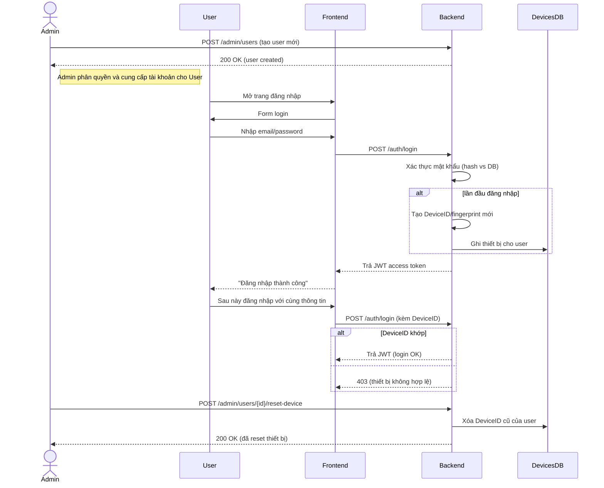

# Tóm tắt

Báo cáo này đề xuất thiết kế hệ thống web app tạo hợp đồng cho tặng quyền sử dụng đất tự động. Hệ thống gồm giao diện người dùng (form nhập liệu theo mẫu hợp đồng) và giao diện quản trị (quản lý người dùng, thiết bị, đơn hàng, nội dung trang). Dữ liệu người dùng (như thông tin cá nhân, CCCD, điện thoại) được kiểm tra nghiêm ngặt (định dạng, check sum, đối chiếu với cơ sở dữ liệu chứng minh), địa chỉ được chọn qua API địa lý chính thức (dữ liệu từ Cục Thống Kê hoặc Google Places). Mỗi tài khoản người dùng chỉ được phép đăng nhập từ **một thiết bị duy nhất** (gắn thiết bị/fingerprint khi lần đầu, chỉ thiết bị đó được dùng, admin có thể đặt lại thiết bị), và mọi hành động (đăng nhập, tạo hợp đồng, xét duyệt admin, v.v.) đều được ghi log chi tiết. Hệ thống sử dụng các biện pháp bảo mật (HTTPS, JWT hoặc session an toàn, refresh token, khóa lâu dài, MFA SMS OTP, mã hóa dữ liệu nhạy cảm như CCCD, chính sách mật khẩu mạnh, giám sát, v.v.) phù hợp với quy định PDPA Việt Nam (NĐ 13/2023, Luật 91/2025 về bảo vệ dữ liệu cá nhân). Kiến trúc backend có thể là Node.js (Express/NestJS) hoặc Python (FastAPI/Django), cơ sở dữ liệu PostgreSQL (với JSONB hoặc đối tượng, Redis cho session), lưu trữ file S3. Các điểm cuối (endpoint) REST sẽ phục vụ xác thực, quản lý người dùng, tạo hợp đồng (xuất PDF/DOCX từ template), và giao diện admin. Giai đoạn MVP tập trung vào: đăng nhập/thiet bị, tạo hợp đồng mẫu (form động, preview), xuất file; admin có thể quản lý user, giao dịch, nội dung (menu, banner, popup). Dự án ưu tiên triển khai dần, từ tính năng cơ bản đến nâng cao, đồng thời đảm bảo tuân thủ bảo mật và lưu trữ nhật ký (Sentry cho lỗi, Prometheus/Grafana giám sát, SIEM cho sự cố bảo mật).  

## 1. Phân tích mẫu hợp đồng và trường dữ liệu cần nhập

Từ mẫu hợp đồng tham khảo (giao ước tặng cho QSD đất kèm tài sản gắn liền)【7†L150-L159】【7†L230-L239】, các trường người dùng cần nhập gồm:

- **Thông tin hợp đồng (metadata)**: Số hợp đồng (ký hiệu chuỗi ký tự, có/không phụ thuộc quy định), Ngày ký (ngày/tháng/năm), Địa điểm ký (tỉnh/thành phố, huyện/quận).  
- **Bên A (bên cho tặng)**: *Nếu cá nhân độc thân:* Họ và tên (chuỗi ký tự), Năm sinh (số 4 chữ số), Số CCCD/CMND (chuỗi số, 9–12 chữ số), Ngày cấp (dd/mm/yyyy), Nơi cấp (tên cơ quan cấp), Hộ khẩu thường trú (chuỗi địa chỉ), Địa chỉ hiện tại (chuỗi địa chỉ), Điện thoại (chuỗi số 10–11 chữ số). Thông tin *“Là chủ sở hữu bất động sản”* (miêu tả ngắn, không bắt buộc) có thể cho biết Bên A sở hữu BĐS gì. *Nếu có đồng chủ sở hữu:* ghi thêm đầy đủ thông tin tương tự cho Người 2 (Họ tên 2, Năm sinh 2, CMND 2, Ngày cấp 2, Nơi cấp 2, Hộ khẩu 2, ĐT 2).  
- **Thông tin giấy tờ sở hữu ban đầu**: Trường hợp hợp đồng cần liệt kê các loại giấy tờ gốc (sổ đỏ, sổ hồng, biên bản, chứng thư) đã cấp cho Bên B, có thể đưa vào mục *“Giấy tờ đã cấp”* (văn bản tự do, không bắt buộc). Ngoài ra, nếu có “Giấy chứng nhận QSDĐ (sổ đỏ)”, các trường liên quan bao gồm: Số GCN (chuỗi ký tự), Ngày cấp (dd/mm/yyyy), Cơ quan cấp (tên, vd: UBND huyện) – các trường này không có trong mẫu ban đầu nhưng thường cần điền cho hợp đồng nhà đất.  
- **Bên B (bên nhận tặng cho)**: Tương tự Bên A (Họ tên, Năm sinh, CCCD/CMND, ngày cấp, nơi cấp, Hộ khẩu, Địa chỉ, ĐT), cộng thêm (nếu có) thông tin đồng sở hữu theo mẫu như trên.  

- **Thông tin thửa đất và tài sản gắn liền** (Điều 1 hợp đồng)【7†L230-L239】【7†L244-L249】: gồm Thửa đất số (số, ví dụ “15”), Tờ bản đồ số (số, “3”), Địa chỉ thửa đất (chuỗi: Xã/Phường, Quận/Huyện, Tỉnh/TP), Diện tích (số m²), (Diện tích bằng chữ có thể tự sinh chữ cho số trên); Hình thức sử dụng: *“Riêng”* (số m²) và *“Chung”* (số m²) – có thể tự tính thành phần sử dụng riêng/chung tuỳ mẫu. Mục đích sử dụng (chuỗi, ví dụ “Lâu dài”), Thời hạn sử dụng (chuỗi, ví dụ “50 năm” hoặc “Lâu dài”), Nguồn gốc sử dụng (chuỗi, ví dụ “Nhà nước giao”), Hạn chế quyền (chuỗi, nếu có), Tài sản gắn liền (miêu tả nhà/cây trồng gắn với đất, không bắt buộc), Giấy tờ quyền sở hữu tài sản (nếu có). Cuối cùng *Giá trị quyền sử dụng đất và tài sản* (số tiền VND, định dạng số, ví dụ 500000000, và bằng chữ có thể auto điền).  

- **Các điều khoản chung khác**: hầu hết cố định, không có trường nhập thêm (Điều 2,3…10 chỉ là văn bản mẫu). Mục “Trách nhiệm nộp thuế” (Điều 4) có phần **bên nào chịu** (chọn “Bên A” hoặc “Bên B”), có thể để 1 ô chọn đơn giản.  

- **Chữ ký và ngày ký**: cuối hợp đồng thường có dòng “Ngày ... tháng ... năm ...”, dòng tên Bên A, Bên B kèm chữ ký. Các trường này thường sử dụng lại tên Bên A/B đã nhập (không cần nhập lại), chỉ cần Điền *Ngày ký* (ngày/tháng/năm) trên giao diện tạo hợp đồng.  

Dưới đây là bảng tóm tắt các trường chính, nhóm theo mục lớn (ví dụ mô tả và kiểm tra dữ liệu):

| **Phần**                    | **Trường (label)**           | **Kiểu**      | **Bắt buộc?** | **Kiểm tra / Ví dụ**                  |
|-----------------------------|------------------------------|---------------|---------------|---------------------------------------|
| **Hợp đồng**                | Số hợp đồng                  | Chuỗi ký tự   | Có            | Định dạng ký hiệu (VD: `001/HĐTCTSGLĐ`) |
|                             | Ngày ký (ngày/tháng/năm)     | Ngày          | Có            | `15/06/2026`                          |
|                             | Nơi ký (tỉnh/thành phố)      | Chuỗi địa chỉ | Có            | `Hà Nội`                              |
| **Bên A (Cho tặng)**        | Họ tên (Ông/Bà)              | Chuỗi         | Có            | `Nguyễn Văn A`                        |
|                             | Năm sinh                     | Số (4 chữ số)| Có            | `1980`                                |
|                             | Số CCCD/CMND                 | Số (9-12 chữ số) | Có         | `012345678901`                        |
|                             | Ngày cấp CCCD                | Ngày          | Có            | `20/01/2010`                          |
|                             | Nơi cấp CCCD                | Chuỗi         | Có            | `CA TP Hà Nội`                        |
|                             | Hộ khẩu thường trú           | Chuỗi         | Có            | `Số 1, Phường X, Quận Y, Hà Nội`     |
|                             | Địa chỉ liên hệ              | Chuỗi         | Có            | `123 Đường A, Quận B, Hà Nội`        |
|                             | Điện thoại                   | Số (10-11)    | Có (nên)      | `0912345678`                          |
|                             | (Nếu có) Đồng chủ sở hữu:     | –             | Không         | **Nhập tương tự** các trường trên cho người 2 (tên, năm sinh, v.v.) |
| **Bên B (Được tặng)**       | Họ tên (Ông/Bà)              | Chuỗi         | Có            | `Trần Thị B`                          |
|                             | Năm sinh                     | Số            | Có            | `1975`                                |
|                             | Số CCCD/CMND                 | Số            | Có            | `098765432109`                        |
|                             | Ngày cấp                     | Ngày          | Có            | `10/05/2015`                          |
|                             | Nơi cấp                      | Chuỗi         | Có            | `CA Huyện Z`                         |
|                             | Hộ khẩu thường trú           | Chuỗi         | Có            | `Số 5, Phường M, Quận N, Hà Nội`     |
|                             | Địa chỉ liên hệ              | Chuỗi         | Có            | `456 Đường C, Quận D, Hà Nội`        |
|                             | Điện thoại                   | Số (10-11)    | Có (nên)      | `0987123456`                          |
|                             | (Nếu có) Đồng sở hữu        | –             | Không         | **Nhập tương tự** cho người 2 bên B    |
| **Giấy chứng nhận đất**     | Số GCN (sổ đỏ)               | Chuỗi         | Không         | `CH012345-2019`                       |
|                             | Ngày cấp GCN                 | Ngày          | Không         | `15/07/2019`                          |
|                             | Cơ quan cấp                  | Chuỗi         | Không         | `UBND Huyện X`                        |
| **Thông tin thửa đất**      | Thửa đất số                  | Số hoặc Chuỗi | Có            | `15`                                  |
|                             | Tờ bản đồ số                 | Số            | Có            | `3`                                   |
|                             | Địa chỉ thửa đất             | Chuỗi địa chỉ | Có            | `Xã Y, Huyện Z, Tỉnh T`               |
|                             | Diện tích (m²)               | Số            | Có            | `100.5`                               |
|                             | Sử dụng riêng (m²)           | Số            | Không         | `60` (≤ diện tích)                    |
|                             | Sử dụng chung (m²)           | Số            | Không         | `40` (≤ diện tích)                    |
|                             | Mục đích sử dụng             | Chuỗi         | Có            | `Lâu dài`                             |
|                             | Thời hạn sử dụng             | Chuỗi         | Có            | `Lâu dài` hoặc `50 năm`              |
|                             | Nguồn gốc sử dụng            | Chuỗi         | Có            | `Nhà nước giao không thu tiền sử dụng` |
|                             | Hạn chế quyền (nếu có)       | Chuỗi         | Không         | `Không có`                            |
|                             | Tài sản gắn liền (nếu có)    | Chuỗi         | Không         | `Nhà cấp 4, diện tích 50m²`          |
|                             | Giấy tờ quyền sở hữu tài sản | Chuỗi         | Không         | `Giấy mua bán năm 2001`              |
|                             | Giá trị QSDĐ+tài sản (VNĐ)   | Số (VNĐ)      | Có            | `500000000` (500 triệu)               |
| **Chữ ký & cam kết**        | Ngày ký hợp đồng             | Ngày          | Có            | `15/06/2026`                          |
|                             | Tên Người đại diện Bên A     | Chuỗi         | Có            | (Trùng với Họ tên Bên A đã nhập)     |
|                             | Tên Người đại diện Bên B     | Chuỗi         | Có            | (Trùng với Họ tên Bên B đã nhập)     |

Những trường in đậm đỏ trên mẫu hợp đồng gốc cần điền tương ứng vào web form. Các trường điện thoại/CCCD được kiểm tra định dạng (libphonenumber cho điện thoại, kiểm tra checksum hoặc độ dài cho CCCD); thông tin địa lý (tỉnh/huyện/xã) được tra cứu tự động qua API địa chính; ngày tháng hợp lệ. Trên giao diện, các trường bắt buộc có thể đánh dấu màu đỏ, có **tooltip/giúp đỡ** hướng dẫn ví dụ định dạng. (Nguồn: dựa trên mẫu [7]).

## 2. Khảo sát API hỗ trợ

**Địa lý hành chính:** Để điền địa chỉ (tỉnh/thành, quận/huyện, xã/phường), nên ưu tiên dùng dữ liệu chính thống. Ví dụ, API *AddressKit* của CASSO sử dụng dữ liệu Cục Thống Kê (NSO) cập nhật liên tục【13†L16-L25】. Một số endpoint mẫu:

- `GET https://production.cas.so/latest/provinces` – danh sách tỉnh thành (hỗ trợ tham số `effectiveDate`).  
- `GET https://production.cas.so/latest/provinces/{provinceID}/communes` – danh sách xã của tỉnh.  
Các API này miễn phí, tự động cập nhật, độ trễ rất thấp (phản hồi gần như realtime), hỗ trợ JSON. Ngoài ra, thư viện và API “Tỉnh thành Việt Nam” (provinces.open-api.vn) cung cấp hai phiên bản (trước/sau sáp nhập 2025)【16†L36-L44】. Ví dụ `GET /api/v2/` trả về toàn bộ danh sách tỉnh/quận/xã dưới dạng JSON. Nếu cần nhập địa chỉ tự động, có thể dùng Google Places Autocomplete API (Autocomplete (New)【22†L326-L334】) để gợi ý địa chỉ dựa trên vùng (bias location tới Việt Nam, ngôn ngữ tiếng Việt). Google Places đòi hỏi API key và có phí theo số request (với gói miễn phí giới hạn khoảng vài nghìn lượt/tháng); độ trễ ~100–300ms trên internet tốt.  

**Xác thực CCCD/CMND (eKYC):** Tại Việt Nam, người dùng có thể xác thực thông tin CCCD gắn chip thông qua các dịch vụ eKYC kết nối với Cơ sở dữ liệu RAR-C06 Bộ Công An. Ví dụ, **VNPT eKYC IDCheck** cung cấp API kiểm tra thông tin trên thẻ CCCD gắn chip chính chủ, cam kết độ chính xác 100% do so sánh trực tiếp với dữ liệu RAR-C06【29†L56-L63】【29†L150-L154】. Thời gian xác thực khoảng 1–2 phút cho cả quy trình (đưa thẻ vào đọc chip)【29†L157-L160】. Họ cũng tích hợp thêm chức năng OCR và so khớp ảnh chân dung chủ thẻ. **Viettel AI** cũng có giải pháp eKYC (OCR và đọc NFC) với độ chính xác cao (NFC đảm bảo 100% độ đúng thông tin gốc)【28†L189-L195】. Những API này thường tính phí theo giao dịch (tỉ lệ thuận với số lần quét). Các hãng thường cung cấp SDK hoặc API REST (JSON) và SLA cao (thời gian <5s/quét). Ngoài ra, có thể dùng giải pháp OCR tổng quát (như Google Vision API, tesseract) cho bước trích xuất, nhưng độ chính xác thấp hơn và không thể kiểm tra dữ liệu gốc. Các dịch vụ này cần tuân thủ quy định bảo mật (dữ liệu CCCD phải mã hóa, không lưu trữ lâu) và Pháp luật An ninh mạng/EKYC Việt Nam.  

**Định dạng và xác thực số điện thoại:** Nên sử dụng thư viện mã nguồn mở **Google libphonenumber** để định dạng (E.164) và kiểm tra tính hợp lệ theo mã vùng (+84). Ngoài ra, các API quốc tế như Twilio Lookup (Lookup v2) cho phép gửi request kiểm tra số điện thoại (định dạng, quốc gia, nhà mạng, trạng thái hoạt động)【32†L159-L168】. Ví dụ:  
```
GET https://lookups.twilio.com/v2/PhoneNumbers/+84123456789?Type=carrier
```
(trả về JSON chứa thông tin nhà mạng, kiểu thuê bao). Twilio tính phí khoảng $0.005/request cho Basic Lookup. Các nhà cung cấp SMS OTP trong nước (như **ABENLA**【36†L53-L57】, **eSMS.vn**【37†L116-L124】, Viettel, VNPT, v.v.) cũng thường hỗ trợ API xác minh OTP, đồng thời có thể kiểm tra số điện thoại qua hệ thống SIM của họ. Ví dụ, ABENLA tuyên bố là “đối tác chiến lược của Viettel, MobiFone, VinaFone” với hệ thống OTP tốc độ cao (5–10 giây gửi tới người dùng)【36†L53-L57】. eSMS.vn còn công bố cung cấp miễn phí API SMS OTP cho doanh nghiệp【37†L116-L124】, hỗ trợ đa ngôn ngữ. Khi dùng SMS OTP, cần chú ý đến thời gian trễ (5–10s là bình thường), kiểm soát tần suất OTP, và lưu token/timestamp để xác minh mã.  

Tóm lại, ưu tiên API địa lý chính thống (AddressKit【13†L16-L25】, provinces.open-api【16†L36-L44】), eKYC chính chủ (VNPT eKYC IDCheck【29†L56-L63】【28†L189-L195】 hoặc Viettel), kiểm tra số điện thoại bằng libphonenumber và nhà cung cấp uy tín (Twilio, SMS OTP VN). Mỗi API cần xem xét mô hình phí (thường trả theo request hoặc gói tháng), độ trễ (~từ vài chục ms đến 1–2s), tính sẵn sàng và quy định bảo mật (ví dụ GDPR/PDPA trong lưu trữ PII khi dùng dịch vụ nước ngoài). 

## 3. Luồng người dùng và quản lý thiết bị

Hệ thống yêu cầu: **(1)** Admin tạo trước tài khoản; **(2)** Người dùng đăng nhập lần đầu, hệ thống lưu dấu vân tay thiết bị; **(3)** Lần sau chỉ cho đăng nhập từ đúng thiết bị đó; **(4)** Nếu đổi thiết bị, admin phải Reset để cho phép. Quy trình chi tiết:

- **Admin tạo tài khoản:** Admin (qua giao diện quản trị) tạo User mới (cung cấp email/tên đăng nhập, mật khẩu tạm). User nhận thông báo kích hoạt (không qua nạp tiền). Hệ thống lưu trong DB `users`.  
- **Đăng nhập lần đầu (User):** Người dùng nhập tên/email + mật khẩu. Backend xác thực (bcrypt/Argon2 đối chiếu hash mật khẩu【45†L204-L212】). Nếu đúng, vì lần đầu, `devices` của User còn trống nên đồng thời ghi nhận DeviceID và fingerprint (kết hợp User-Agent, IP, fingerprint code JS) vào bảng `devices`. Tạo JWT (hoặc session ID) và trả về. Hệ thống ghi log thành công login (user, time, IP, device) vào `login_logs`.  

- **Đăng nhập tiếp theo:** Khi User đăng nhập lần sau, backend nhận DeviceID/fingerprint gửi kèm (trong cookie hoặc header). So sánh với bản ghi trong DB: nếu trùng, cho phép; nếu không, chặn và thông báo rằng chỉ thiết bị đã đăng ký mới được phép. (Có thể yêu cầu OTP để đăng nhập trên thiết bị mới, nhưng theo yêu cầu ở đây, user phải nhờ admin reset). Mỗi lần đăng nhập đều ghi log. Hệ thống chỉ cho một phiên (session) hoạt động tại một thời điểm: khi User đăng nhập thành công trên thiết bị đã ghi, các phiên cũ (cùng user trên thiết bị khác) sẽ tự động hết hạn (invalidated) để tránh đăng nhập đồng thời đa thiết bị.  

- **Quản lý thiết bị (Admin):** Admin panel có chức năng “Reset thiết bị” cho từng user. Khi admin chọn Reset, backend xoá bản ghi DeviceID cũ của user khỏi DB; khi đó user được phép đăng nhập trên thiết bị mới (lần đăng nhập kế tiếp lại lưu thiết bị như ban đầu). Các hoạt động này (Reset thiết bị, tạo user, xóa user) được lưu log dưới danh sách `admin_actions` (ai thực hiện, lúc nào, hành động gì).  

- **Log và giám sát:** Mọi sự kiện quan trọng (login thành công/thất bại, đăng xuất, thay đổi thiết bị, tạo hợp đồng, xuất file, đăng xuất admin, v.v.) được ghi vào bảng `logs` hoặc `login_logs`. Bảng log có cấu trúc: `(id, user_id, event, timestamp, ip, device_id, success/fail, note)`. Ví dụ: `LOGIN_SUCCESS`, `LOGIN_FAILED`, `DEVICE_BIND`, `DEVICE_RESET`, `CONTRACT_CREATED`, `ORDER_VIEW`, `ADMIN_RESET_DEVICE`, v.v. Giữ nhật ký dài hạn (có thể lưu 1–2 năm) để kiểm tra khi cần (đáp ứng kiểm toán), có thể đẩy sang SIEM hoặc ELK để phân tích.  

Dưới đây là ví dụ sơ đồ tuần tự (sequence diagram) minh hoạ luồng **Đăng nhập và đăng ký thiết bị**: 



**Bảng sự kiện & nhật ký (ví dụ)**:

| Sự kiện               | Dữ liệu ghi                  | Mô tả                                 |
|-----------------------|-----------------------------|---------------------------------------|
| `USER_LOGIN_SUCCESS`  | user_id, time, IP, device_id| Đăng nhập thành công                  |
| `USER_LOGIN_FAIL`     | user_id, time, IP, reason   | Đăng nhập thất bại (sai pass/thiết bị)|
| `DEVICE_BIND`         | user_id, device_id, time    | Đăng ký thiết bị mới (lần đầu)         |
| `DEVICE_RESET`        | admin_id, user_id, time     | Admin reset thiết bị của user         |
| `LOGOUT`              | user_id, time               | Đăng xuất                             |
| `PASSWORD_CHANGE`     | user_id, time               | Đổi mật khẩu                          |
| `CONTRACT_CREATE`     | user_id, contract_id, time  | Tạo hợp đồng mới                      |
| `ORDER_VIEW`          | admin_id/user_id, order_id, time | Xem/thao tác đơn hàng            |
| `ADMIN_LOGIN_SUCCESS` | admin_id, time, IP          | Admin đăng nhập                       |
| `ADMIN_ACTION`        | admin_id, action, time      | Thao tác quản trị (vd: tạo user)      |

Các sự kiện này được ghi chi tiết và có thể đưa vào hệ thống SIEM (Security Information and Event Management) để phát hiện hành vi bất thường (login thất bại nhiều lần, địa chỉ IP lạ, v.v.). 

## 4. Bảo mật và xác thực

- **Xác thực & Phiên làm việc:** Nên dùng **JWT** (JSON Web Token) cho API nếu là ứng dụng SPA/di động, hoặc **Session Cookie** (HTTP-only, Secure) nếu web. Với JWT, dùng `access token` thời gian ngắn (10-30 phút) và `refresh token` (lưu trong HttpOnly cookie) để cấp mới token khi hết hạn. Refresh token cần lưu trên DB để có thể thu hồi (logout hoặc reset phiên). Mỗi JWT gắn với một `device_id` và phiên người dùng. Để thực hiện “one-session-one-device”, khi phát hiện login mới từ thiết bị hợp lệ, hệ thống phải đánh dấu các token cũ hết hạn (với JWT là blacklist hoặc lưu thông tin phiếu hiện tại). Các endpoint yêu cầu auth đều kiểm tra token hợp lệ và device khớp. Đối với admin, có thể tách nhóm giao diện riêng (ví dụ URI `/admin/*`) với middleware kiểm tra role “admin”.  
- **Mật khẩu:** Lưu trữ bằng hash an toàn (đề xuất Argon2id hoặc bcrypt)【45†L204-L212】; mỗi password có salt riêng. Không lưu mật khẩu ở dạng plaintext. Chính sách mật khẩu nên tối thiểu 8 ký tự, bao gồm chữ thường, chữ hoa, số, ký tự đặc biệt. Có thể khóa tài khoản sau N lần đăng nhập sai liên tục (ví dụ 5 lần), kèm captcha hoặc OTP để tăng bảo vệ.  
- **Xác thực đa nhân tố (MFA):** Bổ sung SMS OTP khi đăng nhập từ thiết bị mới hoặc thực hiện các hành động nhạy cảm (đổi thông tin cá nhân). API OTP có thể dùng chính các provider SMS hoặc Twilio. Thời gian sống OTP ngắn (30-60s) và giới hạn số lần thử.  
- **Mã hóa & Bảo vệ dữ liệu nhạy cảm:** Các trường PII như CCCD, địa chỉ, v.v. cần được mã hóa khi lưu trữ. Ví dụ, dùng AES-256 trên DB hoặc hỗ trợ field-level encryption (ví dụ PostgreSQL với pgcrypto, hoặc ORM có thể mã hóa cột). Theo khuyến cáo an ninh, “cần ẩn hoặc mã hóa một phần dữ liệu nhạy cảm”【42†L237-L240】. Khóa mã hóa bảo mật (KMS/HSM) phải quản lý riêng (AWS KMS, Azure Key Vault, HSM tại chỗ). Dữ liệu nhạy cảm nên lưu ít nhất có bảo vệ: database disk encryption (TDE), field encryption. Backup dữ liệu cũng phải mã hóa. Theo quy định PDPA Việt Nam, chỉ lưu trữ dữ liệu cá nhân trong thời gian cần thiết, phải được sự đồng ý, và cung cấp khả năng xoá/hủy khi có yêu cầu.  
- **Giới hạn & chống tấn công:** Giới hạn tốc độ (rate limiting) API đăng nhập và OTP (VD: tối đa 5 request/phút từ một IP/thiết bị). Chống brute-force: CAPTCHA sau vài lần nhập sai. Bảo vệ chống CSRF (nếu dùng cookies) bằng token CSRF. Dùng HTTPS toàn bộ, config CSP/headers bảo mật (HSTS). API nên có cơ chế giới hạn quyền (RBAC): chỉ admin mới truy cập các endpoint quản trị. Thường xuyên cập nhật thư viện bảo mật (dependency scan).  
- **Kiểm toán & Giám sát:** Tích hợp công cụ giám sát (Prometheus/Grafana cho metrics server, Sentry cho ghi nhận lỗi runtime, hệ thống SIEM như ELK/Wazuh cho log bảo mật). Ghi log audit (ai tạo/sửa xoá user, ai tạo đơn hàng, admin duyệt thiết bị).  
- **Tuân thủ PDPA/GDPR:** Theo **Nghị định 13/2023** và **Luật Bảo vệ Dữ liệu cá nhân 2025** (PDPA), người dùng có quyền được biết và yêu cầu cung cấp thông tin về dữ liệu cá nhân của mình【42†L269-L274】, đồng thời quyền đòi xóa khi không còn nhu cầu. Ứng dụng cần hiển thị chính sách riêng tư, cơ chế lấy đồng ý (cookie, OTP) cho việc lưu trữ dữ liệu cá nhân. Dữ liệu người dùng (CCCD, số điện thoại) không được chia sẻ với bên thứ ba. Tất cả thông tin nhạy cảm phải tuân quy định lưu trữ an toàn (ví dụ Vault cho chìa khóa, logging tuân PDPA về lưu giữ và loại trừ gốc dữ liệu).

## 5. Kiến trúc backend, database và API

**Công nghệ đề xuất:** Có thể dùng Node.js/Express hoặc framework NestJS cho backend (với Typescript), hoặc Python FastAPI/Django Rest Framework. CSDL quan hệ: **PostgreSQL** (thêm JSONB để lưu linh hoạt các trường hợp đặc biệt). Sử dụng **Redis** cho lưu phiên/session hoặc cache (như cache địa lý hoặc token). File (template, PDF sinh ra) lưu trên object storage S3-compatible (AWS S3 hoặc MinIO).  

**Sơ đồ bảng (ERD):** Dùng sơ đồ Erdiagram (Mermaid) như minh hoạ:

```mermaid
erDiagram
    USERS ||--o{ DEVICES : "ghi thiết bị của"
    USERS ||--o{ ORDERS  : "tạo"
    USERS ||--o{ LOGS    : "ghi log bởi"
    ADMIN   ||--o{ ADMIN_ACTIONS : "thực hiện"
    ORDERS ||--o{ CONTRACTS : "sinh ra"
    CONTRACTS ||--|{ TEMPLATES : "dựa trên"
    DEVICES {
        string device_id PK
        int user_id FK
        string fingerprint
        datetime bound_at
    }
    USERS {
        int id PK
        string name
        string email
        string password_hash
        string role
        bool active
    }
    ORDERS {
        int id PK
        int user_id FK
        int template_id FK
        datetime created_at
        string status
    }
    CONTRACTS {
        int id PK
        int order_id FK
        string file_url
        datetime generated_at
    }
    TEMPLATES {
        int id PK
        string name
        string docx_path
        string preview_html
    }
    LOGS {
        int id PK
        int user_id FK (nullable)
        string event
        datetime timestamp
        string detail
    }
    ADMIN_ACTIONS {
        int id PK
        int admin_id FK (người thực hiện)
        string action
        datetime timestamp
        string target
    }
```

(**Chú ý:** Trong mermaid ER, `PK` đánh dấu khoá chính, `FK` khoá ngoại.)

**Bảng chi tiết (đáng chú ý):**

- **users**: (id, name, email, password_hash, role(“user”/“admin”), active, …).  
- **devices**: (device_id (có thể là UUID), user_id, fingerprint (hash), created_at, last_used_at). Mỗi user có tối đa 1 bản ghi (có thể xóa để reset).  
- **orders**: (id, user_id, template_id, data_json, created_at, status). “data_json” có thể lưu tạm dữ liệu người dùng nhập (nếu cần), nhưng thông thường sinh ngay contract.  
- **templates**: (id, name, docx_file, html_preview, created_at) lưu mẫu hợp đồng có chỗ cắm dữ liệu (dùng Handlebars hoặc DocxTemplater).  
- **contracts**: (id, order_id, pdf_url, docx_url, generated_at) – lưu kết quả xuất file.  
- **logs**: (id, user_id (nullable), event, detail, ip, created_at). Ghi log hệ thống.  
- **admin_actions**: (id, admin_id, action (vd: “RESET_DEVICE”), target_user_id, timestamp).  

**Các API endpoint chính (REST):** (có thể chuyển thành GraphQL nếu thích, nhưng REST đơn giản và phổ biến)

- **Authentication:**  
  - `POST /auth/login` – {email, password, device_id}. Trả token.  
  - `POST /auth/refresh` – {refreshToken}. Đổi token.  
  - `POST /auth/logout` – invalidate refreshToken.  
  - `POST /auth/forgot-password` (OTP/email).  
- **Users (Admin):**  
  - `GET /admin/users` – danh sách user (admin).  
  - `POST /admin/users` – tạo mới user (admin).  
  - `PATCH /admin/users/{id}/device-reset` – reset thiết bị của user (admin)【29†L157-L160】.  
  - `GET /admin/users/{id}` – xem thông tin user.  
  - `DELETE /admin/users/{id}` – (nếu cần).  
- **Templates:**  
  - `GET /templates` – danh sách mẫu (không auth hoặc auth user).  
  - `GET /templates/{id}` – chi tiết mẫu.  
- **Orders / Contracts:**  
  - `POST /orders` – tạo đơn mới (chọn template_id + payload các trường). Trả về order_id.  
  - `GET /orders/{id}` – chi tiết đơn (user/ admin).  
  - `POST /orders/{id}/generate` – xuất hợp đồng. Hệ thống nhận dữ liệu, nhúng vào template, tạo file PDF/DOCX và lưu vào S3, ghi `contracts`.  
  - `GET /contracts/{id}/download?format=pdf|docx` – tải về file.  
  - `GET /orders` – xem danh sách đơn của user (hoặc `/admin/orders` cho admin).  
- **Admin content:** (menu, banner, popup)  
  - `GET/POST/PUT/DELETE /admin/menus, /admin/banners, /admin/popups` – quản lý nội dung hiển thị. (Nếu cần, đơn giản CRUD bảng lưu menu/banner với hình/đường dẫn).  
- **Device/Session:** (nếu lưu logout, session)  
  - `GET /devices` – (user) xem thiết bị hiện dùng.  
  - `POST /devices/logout` – đăng xuất/hủy phiên (xóa JWT).  

Mỗi endpoint bảo vệ bằng middleware xác thực (JWT/session) và phân quyền. Ví dụ, các route `/admin/*` chỉ cho admin, route `/orders` chỉ cho user tương ứng hoặc admin. Nên thêm giới hạn rate limit (ví dụ 100 req/phút cho người dùng) để chống DDOS.

**Tạo hợp đồng:** Đầu vào JSON từ form sẽ được gán vào template hợp đồng. Có thể sử dụng thư viện như Handlebars (HTML) kết hợp Puppeteer hoặc wkhtmltopdf để chuyển sang PDF, hoặc thư viện DocxTemplater (nhúng dữ liệu vào file DOCX template) và sau đó xuất PDF. Ví dụ, endpoint `POST /orders/{id}/generate` lấy dữ liệu, gọi DocxTemplater, lưu kết quả.  

## 6. Thiết kế UI/UX và form hợp đồng

Giao diện người dùng cần rõ ràng, chia thành các section tương ứng hợp đồng: thông tin Bên A, Bên B, thửa đất, thời hạn, v.v. Các trường yêu cầu nhập có màu đỏ (theo yêu cầu). Ví dụ form có thể chia 2 cột, mỗi cột gồm các trường nhập, giữa có dòng tách phần. Dưới đây là bảng mẫu “Map form -> mẫu HĐ” (ví dụ minh hoạ):

| **Trường form (label)**                 | **Chỗ điền trên hợp đồng (placeholder)**                  |
|-----------------------------------------|-----------------------------------------------------------|
| Họ tên (Bên A)                          | Ông/Bà: _______________________                           |
| Năm sinh (Bên A)                        | Năm sinh: _____                                           |
| Số CCCD (Bên A)                         | CMND số: _____                                            |
| Ngày cấp CCCD (Bên A)                   | Ngày cấp: ___ Tháng ___ Năm ____                           |
| Nơi cấp CCCD (Bên A)                    | Nơi cấp: _____                                            |
| Địa chỉ thường trú (Bên A)              | Hộ khẩu: _________________________                       |
| Địa chỉ liên hệ (Bên A)                 | Địa chỉ: _________________________                       |
| Điện thoại (Bên A)                      | Điện thoại: ____________________                          |
| (Nếu có) Đồng chủ sở hữu (Bên A)        | (Các trường tương tự cho Người 2)                         |
| … *(tương tự cho Bên B)*                | … (các vị trí bên B)                                      |
| Thửa đất số                             | Thửa đất số: __________                                   |
| Tờ bản đồ số                            | Tờ bản đồ số: _________                                   |
| Địa chỉ thửa đất                        | Địa chỉ thửa đất: __________________________             |
| Diện tích (m²)                          | Diện tích: ______ m² (Bằng chữ: ______)                   |
| Hình thức SD (Riêng/Chung)              | Sử dụng riêng: __ m², Sử dụng chung: __ m²                |
| Mục đích sử dụng                        | Mục đích sử dụng: ______________________               |
| Thời hạn sử dụng                        | Thời hạn sử dụng: __________________                     |
| Nguồn gốc sử dụng                       | Nguồn gốc sử dụng: __________________                    |
| Hạn chế (nếu có)                        | Những hạn chế: __________________ (nếu có)                 |
| Tài sản gắn liền (nếu có)               | Tài sản gắn liền: ______________________                 |
| Giấy tờ quyền sở hữu TSG đất            | Giấy tờ sở hữu: ___________________                     |
| Giá trị QSDĐ + tài sản (VNĐ)            | (Mục giá trị hợp đồng, hiển thị ở Điều 1.3)              |

Form có thể hiện label rõ, bên dưới mỗi trường (hoặc tooltip) có hướng dẫn định dạng (vd: “CCCD gồm 12 chữ số”). Các trường ngày nên dùng DatePicker chuẩn. Số điện thoại có thể tự động format (vd: +84…).

Sau khi người dùng nhập xong, cho xem **Preview** hợp đồng ngay trong trình duyệt, với các chỗ điền tô đỏ (tương tự mẫu) để kiểm tra. Sau đó, người dùng nhấn “Tạo hợp đồng” để nhận file PDF (hoặc DOCX).  

**Hành trình người dùng (flowchart):** Ví dụ luồng UI cho user và admin:

```mermaid
flowchart LR
    subgraph User
        A[Đăng nhập (User)] --> B[Chọn mẫu hợp đồng]
        B --> C[Điền thông tin hợp đồng vào form]
        C --> D[Xem trước & chỉnh sửa]
        D --> E[Tạo & tải về hợp đồng (PDF/DOCX)]
    end
    subgraph Admin
        A2[Đăng nhập (Admin)] --> M1[Quản lý người dùng/thiết bị]
        A2 --> M2[Quản lý đơn hàng/hợp đồng]
        A2 --> M3[Quản lý menu/banner/popup]
        M1 --> R{Reset thiết bị, Duyệt user}
        M2 --> O[Xem danh sách đơn]
    end
```

Có thể thêm bước: **Đăng ký** (nếu mở cho user tự đăng ký; theo yêu cầu thì user do admin cung cấp tài khoản, nên bỏ bớt).

Giao diện admin (MVP) đơn giản: bảng danh sách users (tìm kiếm, xem chi tiết, reset thiết bị), danh sách đơn hàng/hợp đồng (người dùng đã tạo), phần quản lý nội dung (menu, banner, popup) để chỉnh sửa trang tĩnh, và xem thống kê (tùy chọn). 

## 7. Kế hoạch triển khai & phạm vi MVP

**Phân tích tính năng & MVP:** Gói những tính năng tối thiểu cần có ban đầu: 
1. **Xác thực & Quản lý thiết bị** (đăng nhập, JWT, luồng 1 thiết bị) – *Ưu tiên cao* (MVP cần ngay). Effort: Trung bình (xây dựng auth + lưu device).  
2. **Form hợp đồng & biểu mẫu (UI)** – *Ưu tiên cao*. Form nhiều trường, validation (CCCD, điện thoại, bắt buộc). Effort: Trung bình (UI + validate, responsive, tooltips).  
3. **Tạo hợp đồng từ template** – *Ưu tiên cao*. Chọn template, nhúng dữ liệu vào template, xuất PDF. Effort: Trung bình–Cao (tùy chọn lib xuất file).  
4. **Admin Panel (MVP)** – *Ưu tiên cao*. Chức năng: Quản lý người dùng (khóa/mở, reset thiết bị), danh sách đơn/hợp đồng người dùng, quản lý nội dung cơ bản (menu, banner, popup). Effort: Trung bình.  
5. **API địa lý & kiểm tra input** – *Ưu tiên vừa*. Tích hợp gọi API địa lý, xác thực điện thoại (libphonenumber). Effort: Trung bình.  
6. **Xác thực CCCD nâng cao** – *Ưu tiên thấp* (cho MVP có thể chỉ kiểm tra hình thức, không tích hợp ngay eKYC). Effort: Cao (phụ thuộc hợp đồng bên thứ ba).  
7. **MFA SMS OTP** – *Ưu tiên thấp* (có thể hoãn MVP). Effort: Trung bình–Cao (tích hợp gateway SMS).  
8. **Báo cáo & Logging nâng cao** – *Ưu tiên vừa/Thấp*. (MVP chỉ log cơ bản, sau triển khai thêm SIEM). Effort: Trung bình.  

Dự kiến milestone: 
- _Sprint 1-2 (2-4 tuần)_: Xây dựng hệ thống login + device binding + DB schema.  
- _Sprint 3-4_: Triển khai form hợp đồng (UI/validation) và backend lưu dữ liệu.  
- _Sprint 5-6_: Triển khai tính năng render hợp đồng (Docx/PDF) và thử nghiệm.  
- _Sprint 7_: Phát triển Admin Panel (user management, device reset, xem danh sách đơn) và nội dung tĩnh (menu, banner).  
- _Sprint 8_: Tinh chỉnh, test bảo mật, deploy.  

**Đầu ra MVP:** Đến giai đoạn đầu, hệ thống cho phép admin tạo tài khoản, user đăng nhập, điền thông tin và tạo hợp đồng tự động. Chức năng nạp tiền/giao dịch thanh toán bị loại trừ (theo yêu cầu). Admin có thể quản lý user, reset thiết bị, xem hợp đồng, chỉnh sửa menu/banner/popup cơ bản.

## 8. Tuân thủ và giám sát

- **Quy định bảo mật**: Tuân theo **Nghị định 13/2023/NĐ-CP (PDPA)** và **Luật Bảo vệ dữ liệu cá nhân (số 91/2025/QH15)** mới ban hành. Đảm bảo minh bạch trong thu thập, lưu trữ dữ liệu cá nhân, cho phép user “được biết, được cung cấp thông tin chi tiết về hoạt động xử lý dữ liệu cá nhân liên quan đến mình”【42†L269-L274】 và có thể yêu cầu xóa. Dữ liệu số CCCD, điện thoại phải được mã hóa và hạn chế truy cập. Nên bổ sung consent khi user nhập data cá nhân (như tick “Đồng ý chính sách”). Khai báo rõ “Quyền riêng tư” theo mẫu.  
- **Kiểm tra & giám sát**: Sử dụng Sentry cho theo dõi lỗi runtime, Prometheus+Grafana giám sát hiệu suất và số lượng request, SIEM/Elastic Stack phân tích log hệ thống. Đề xuất tích hợp hệ thống WAF hoặc bật các rules bảo mật trên host cloud (tùy hạ tầng).  
- **Sao lưu và phòng ngừa:** Sao lưu DB định kỳ (Encrypted snapshot), mã hóa key backup. Có kế hoạch phục hồi sự cố. Xử lý khóa (key rotation) cho JWT và dữ liệu nhạy cảm.  
- **Giám sát người dùng:** Cảnh báo tự động nếu có nhiều lần đăng nhập thất bại, hoặc nhiều thiết bị lạ. Theo dõi truy cập admin panel, gửi thông báo qua email nếu có thay đổi quan trọng (tạo user, reset thiết bị).  
- **Tuân thủ khác:** Nếu cần hội nhập (ví dụ kê khai ở Sở Thông tin Truyền thông), tuân thủ 91/GP-TTĐT. Đảm bảo ghi log đủ cho audit, tuân chuẩn ISO/IEC 27001 nếu làm tại doanh nghiệp yêu cầu. 

**Nguồn tham khảo:** Thiết kế dựa trên mẫu hợp đồng tham khảo【7†L150-L159】【7†L230-L239】, tài liệu hướng dẫn bảo mật của OWASP【45†L204-L212】, và thông tin về API/Xác thực (VNPT eKYC【29†L56-L63】【29†L157-L160】, API địa lý NSO【13†L16-L25】, Google Places【22†L326-L334】, Twilio Lookup【32†L159-L168】, dịch vụ SMS OTP ABENLA【36†L53-L57】 và eSMS.vn【37†L116-L124】). Các công cụ giám sát (Sentry, Prometheus) và phương pháp mã hóa tuân theo best practice bảo mật.